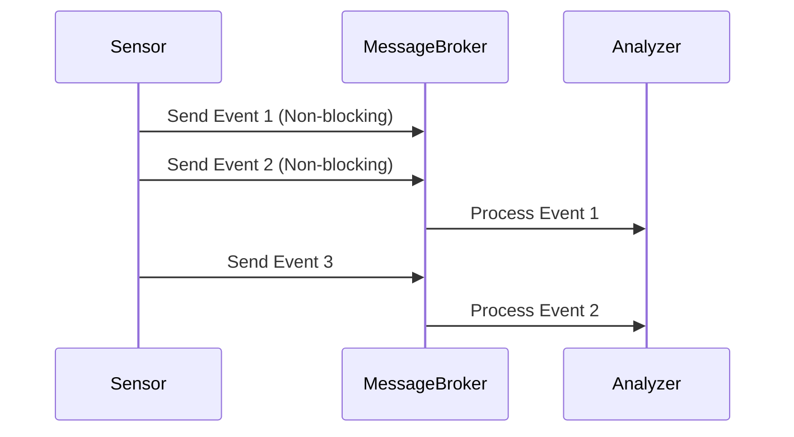

# Module 32: Asynchronous Streaming Architecture

## 1. What is it? (Explain from scratch for a complete beginner)
When you order food at a busy fast-food restaurant, you don't stand at the counter waiting while they cook it. You take a receipt, sit down, and they call your number when it's ready. Meanwhile, the cashier keeps taking orders. This is "asynchronous" processing. In cybersecurity architectures like CyberOS, an Asynchronous Streaming Architecture means that systems generate alerts and logs continuously without pausing to wait for the analysis engine to finish reading the previous one. Data flows in a constant, independent stream.

## 2. Architecture / Flow (MUST include a Mermaid flowchart/diagram)


## 3. Implementation (Include Python/React code snippets)
```python
import asyncio

async def generate_alerts():
    for i in range(3):
        print(f"Generating Alert {i}")
        await asyncio.sleep(1) # Simulates delay without blocking the whole program

async def analyze_alerts():
    for i in range(3):
        print(f"Analyzing Alert {i}")
        await asyncio.sleep(2) # Slower analysis process

async def main():
    # Run both tasks concurrently
    await asyncio.gather(
        generate_alerts(),
        analyze_alerts()
    )

if __name__ == "__main__":
    asyncio.run(main())
```

## 4. Line-by-Line Explanation
1. `import asyncio`: Imports Python's library for asynchronous programming.
2. `async def generate_alerts()`: Defines an asynchronous function to create alerts.
3. `for i in range(3)`: Loops 3 times.
4. `print(...)`: Prints which alert is being generated.
5. `await asyncio.sleep(1)`: Pauses this specific function for 1 second, but allows other functions to run in the meantime!
6. `async def analyze_alerts()`: Defines a second async function for analysis.
7. `await asyncio.sleep(2)`: Simulates a slower analysis time.
8. `async def main()`: The main entry point of the program.
9. `asyncio.gather(...)`: This is the magic! It runs both functions at the exact same time independently.
10. `asyncio.run(main())`: Starts the asynchronous loop.

## 5. Summary
Asynchronous streaming ensures that high-speed data generation (like security sensors) isn't bottlenecked by slower processes (like deep malware analysis). By decoupling these components, the system remains fast and highly responsive.
