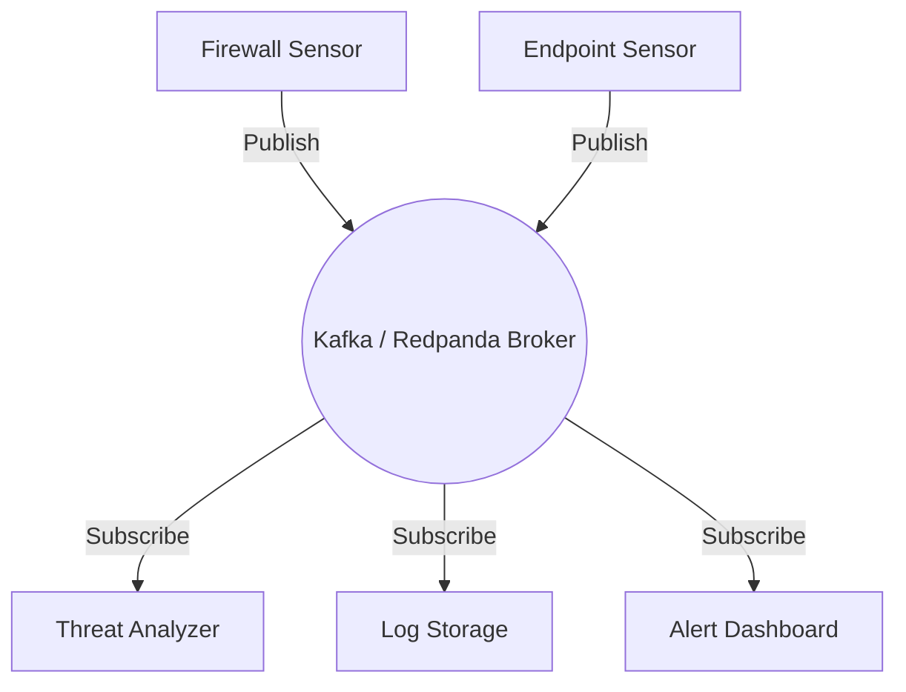

# Module 33: Kafka and Redpanda (Message Brokers)

## 1. What is it? (Explain from scratch for a complete beginner)
Imagine a massive post office. Millions of letters (data messages) arrive every second. Without a system, it would be chaos. A Message Broker is like the ultimate post office sorting facility. Apache Kafka and Redpanda are popular software tools that act as message brokers. In the PS26145 architecture, when hundreds of sensors detect suspicious activity, they don't send data directly to the database. They send it to Kafka or Redpanda, which organizes the messages into "topics" and holds them safely until the analysis servers are ready to read them.

## 2. Architecture / Flow (MUST include a Mermaid flowchart/diagram)


## 3. Implementation (Include Python/React code snippets)
```python
from kafka import KafkaProducer
import json

# Initialize the producer (sender) connecting to the broker
producer = KafkaProducer(
    bootstrap_servers=['localhost:9092'],
    value_serializer=lambda v: json.dumps(v).encode('utf-8')
)

# The data we want to send
security_event = {
    "event_type": "login_failure",
    "ip_address": "192.168.1.45",
    "severity": "high"
}

# Send the data to a specific 'topic' or category
producer.send('security_alerts_topic', security_event)
producer.flush() # Ensure all messages are sent

print("Message successfully sent to the broker!")
```

## 4. Line-by-Line Explanation
1. `from kafka import KafkaProducer`: Imports the tool to send (produce) messages to Kafka.
2. `import json`: Imports the JSON library to format our data nicely.
3. `producer = KafkaProducer(...)`: Connects to our broker running on `localhost` port `9092`.
4. `value_serializer=...`: Tells Kafka to convert our Python dictionary into a JSON string and encode it as bytes before sending.
5. `security_event = {...}`: We define a dictionary containing the details of a hacking attempt.
6. `producer.send(...)`: Sends the event to a specific mailbox named `security_alerts_topic`.
7. `producer.flush()`: Waits for the broker to acknowledge receipt.
8. `print(...)`: Confirmation message.

## 5. Summary
Message brokers like Kafka and Redpanda act as heavy-duty shock absorbers in a cybersecurity system. They ensure that even if thousands of alerts happen in one second, no data is lost, and systems can read the data at their own pace.
