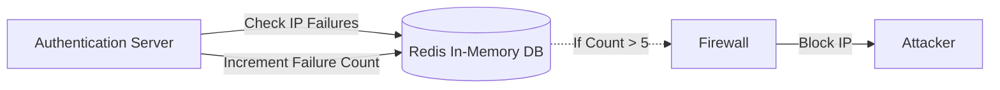

# Module 34: Redis State Management

## 1. What is it? (Explain from scratch for a complete beginner)
Think of your computer's hard drive versus its RAM. The hard drive is slow but permanent. RAM is incredibly fast but temporary. Redis is a database that lives entirely in RAM (memory). Because it is so fast, we use it for "State Management"—keeping track of what is happening *right now*. In the PS26145 architecture, if an IP address fails to log in 5 times in a minute, we need a blazing-fast way to count those failures. Redis stores this temporary count (the "state") so the security system can block the IP instantly.

## 2. Architecture / Flow (MUST include a Mermaid flowchart/diagram)


## 3. Implementation (Include Python/React code snippets)
```python
import redis

# Connect to the local Redis server
r = redis.Redis(host='localhost', port=6379, db=0)

attacker_ip = "203.0.113.50"
redis_key = f"failed_logins:{attacker_ip}"

# Increment the failure count for this IP
failures = r.incr(redis_key)

# Set the counter to expire (reset) after 60 seconds
if failures == 1:
    r.expire(redis_key, 60)

print(f"IP {attacker_ip} has failed {failures} times.")

if failures >= 5:
    print("ALERT: Blocking IP! Too many failed attempts.")
```

## 4. Line-by-Line Explanation
1. `import redis`: Imports the Python library to interact with Redis.
2. `r = redis.Redis(...)`: Connects to the Redis server running locally.
3. `attacker_ip = "203.0.113.50"`: The IP address we are monitoring.
4. `redis_key = ...`: Creates a unique label (key) to store the data under, like `failed_logins:203.0.113.50`.
5. `failures = r.incr(redis_key)`: This is the magic! It increases the count by 1. If the key doesn't exist, it creates it and sets it to 1.
6. `if failures == 1:`: Checks if this is the first failed attempt.
7. `r.expire(redis_key, 60)`: If it's the first attempt, we tell Redis to delete this memory after 60 seconds (a 60-second window).
8. `if failures >= 5:`: Checks if they have failed 5 or more times.
9. `print("ALERT...")`: Triggers the block if the threshold is reached.

## 5. Summary
Redis provides ultra-fast, temporary storage perfect for keeping track of live, changing data. In cybersecurity, it is the go-to tool for rate-limiting, tracking live sessions, and counting rapid events to detect anomalies instantly.
