# Module 35: Tumbling Windows in Stream Processing

## 1. What is it? (Explain from scratch for a complete beginner)
Imagine you are counting cars on a highway. Instead of counting forever, you decide to count how many cars pass every 5 minutes. At 1:00, you start counting. At 1:05, you write down the total, reset the counter to zero, and start counting again for the 1:05-1:10 period. These distinct, non-overlapping time chunks are called "Tumbling Windows." In stream processing (CyberOS), we analyze millions of security logs by grouping them into tumbling windows (e.g., exactly 1-minute blocks) to detect spikes in traffic or continuous password guessing.

## 2. Architecture / Flow (MUST include a Mermaid flowchart/diagram)

```mermaid

gantt
    title Tumbling Windows (Non-Overlapping)
    dateFormat  s
    axisFormat %S
    section Continuous Data Stream
    Window 1 (0s - 5s) :a1, 0, 5s
    Window 2 (5s - 10s) :a2, 5, 10s
    Window 3 (10s - 15s) :a3, 10, 15s
```


## 3. Implementation (Include Python/React code snippets)
```python
import time

def process_tumbling_window(window_size_seconds):
    print(f"Starting Tumbling Window of {window_size_seconds} seconds.")
    event_count = 0
    start_time = time.time()
    
    while True:
        # Simulate an event arriving
        event_count += 1
        current_time = time.time()
        
        # Check if the window time has expired
        if current_time - start_time >= window_size_seconds:
            print(f"--- Window closed! Total events in this window: {event_count} ---")
            
            # Reset for the next tumbling window
            event_count = 0
            start_time = time.time()
            
        time.sleep(0.5) # Simulate events coming in every 0.5 seconds

# process_tumbling_window(5) # Run this to see it in action!
```

## 4. Line-by-Line Explanation
1. `import time`: Allows us to track the current time.
2. `def process_tumbling_window(...)`: Defines a function that takes the window size in seconds.
3. `event_count = 0` and `start_time = time.time()`: Initializes our counter and marks the exact starting time of the window.
4. `while True:`: Creates an infinite loop to process continuous data.
5. `event_count += 1`: Simulates a new security event arriving.
6. `current_time = time.time()`: Checks the exact time right now.
7. `if current_time - start_time >= window_size_seconds:`: Math to check if our 5-second (or whatever size) window is up.
8. `print(...)`: Outputs the summary of that specific window.
9. `event_count = 0` and `start_time = time.time()`: Resets everything to completely fresh for the next non-overlapping window.

## 5. Summary
Tumbling windows chop an endless stream of data into neat, discrete time blocks. This makes it possible for cybersecurity systems to analyze data mathematically (like calculating averages or identifying sudden spikes) without running out of memory trying to analyze infinity.
