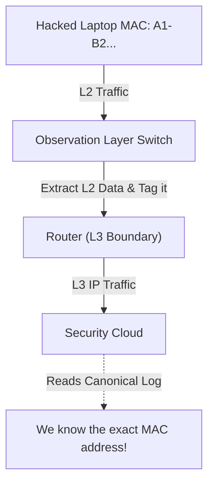

# Module 36: The Canonical Observation Layer (L2 vs L3 fix)

## 1. What is it? (Explain from scratch for a complete beginner)
In networking, data travels in layers. Layer 2 (L2) deals with MAC addresses (physical hardware limits, usually confined to one building). Layer 3 (L3) deals with IP addresses (the internet, routed globally). A common problem in security architectures is losing the original hardware (MAC) address when traffic jumps over a router to an L3 network. The "Canonical Observation Layer" in CyberOS is a dedicated design pattern where we extract and attach the L2 physical hardware data to the logs *before* it gets routed to L3, ensuring we always know exactly which physical machine generated the threat.

## 2. Architecture / Flow (MUST include a Mermaid flowchart/diagram)


## 3. Implementation (Include Python/React code snippets)
```python
# Simulating the Canonical Observation Layer tagging process

def observation_layer_tagger(raw_packet):
    # Imagine we extract this directly from the raw Ethernet frame at L2
    mac_address = raw_packet.get("hardware_mac")
    ip_address = raw_packet.get("source_ip")
    payload = raw_packet.get("data")
    
    # We create a 'Canonical' (standardized) log entry containing BOTH L2 and L3 data
    canonical_log = {
        "l2_identity": mac_address,
        "l3_identity": ip_address,
        "threat_data": payload,
        "is_canonical": True
    }
    
    return canonical_log

incoming_traffic = {"hardware_mac": "00:1A:2B:3C:4D:5E", "source_ip": "192.168.1.15", "data": "malware.exe"}

standardized_log = observation_layer_tagger(incoming_traffic)
print(f"Forwarding to Cloud: {standardized_log}")
```

## 4. Line-by-Line Explanation
1. `def observation_layer_tagger(raw_packet)`: A function representing our specialized network switch.
2. `mac_address = raw_packet.get("hardware_mac")`: Extracts the physical Layer 2 MAC address.
3. `ip_address = raw_packet.get("source_ip")`: Extracts the routing Layer 3 IP address.
4. `canonical_log = {...}`: We construct a new, standardized JSON object. Even though the router will strip the MAC address from the actual network packet, it will remain safely inside this log data payload.
5. `incoming_traffic = {...}`: Simulates a packet arriving at the switch.
6. `standardized_log = ...`: Processes the packet.
7. `print(...)`: Shows the final log that gets sent to the central SIEM (Security Information and Event Management) system.

## 5. Summary
By observing and tagging data at Layer 2 before it passes through Layer 3 routers, the Canonical Observation Layer ensures critical physical identifying information is never lost. This "fix" guarantees security teams can always trace an attack back to the specific physical device.
