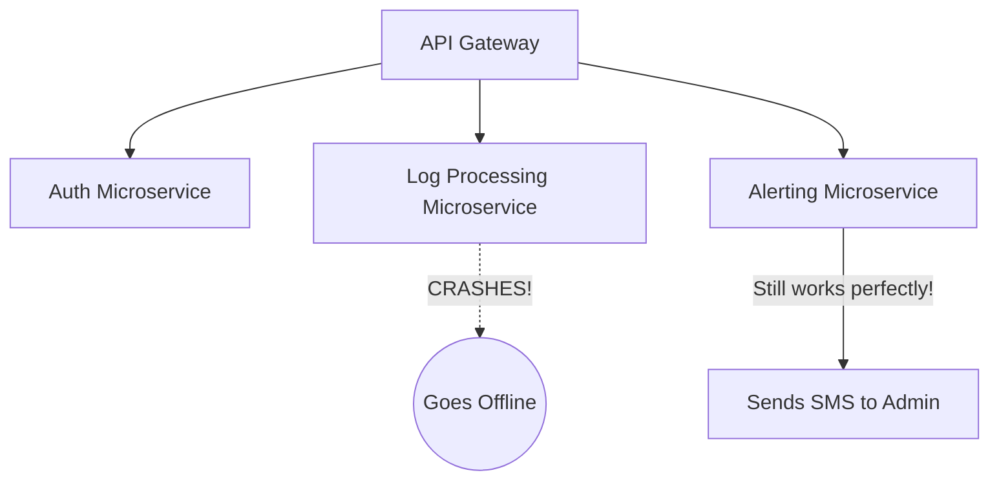

# Module 37: Microservices and Fault Tolerance

## 1. What is it? (Explain from scratch for a complete beginner)
Imagine a giant cruise ship. If it has only one hull and gets a hole, the whole ship sinks (this is a "monolithic" app). Now imagine a ship made of 100 separate, sealed compartments. If one gets a hole, only that compartment floods, and the ship keeps sailing. This is "Microservices and Fault Tolerance." In the CyberOS architecture, the security system is broken into small, independent programs (microservices). If the 'Log Reader' service crashes, the 'Alert Dashboard' keeps running perfectly fine. Fault tolerance is the ability to survive those crashes.

## 2. Architecture / Flow (MUST include a Mermaid flowchart/diagram)


## 3. Implementation (Include Python/React code snippets)
```python
import requests
from requests.exceptions import RequestException
import time

def call_alert_microservice():
    url = "http://localhost:8001/send_alert"
    max_retries = 3
    
    # Fault Tolerance: Implement a Retry Mechanism
    for attempt in range(max_retries):
        try:
            print(f"Attempt {attempt + 1} to reach Alert Service...")
            response = requests.post(url, json={"msg": "Intrusion!"}, timeout=2)
            if response.status_code == 200:
                print("Alert successfully sent!")
                return True
        except RequestException as e:
            print(f"Service failed to respond. Error: {e}")
            time.sleep(1) # Wait 1 second before retrying
            
    print("CRITICAL: Alert Microservice is completely down. Logging to local backup.")
    return False

# call_alert_microservice()
```

## 4. Line-by-Line Explanation
1. `import requests`: Imports a library to make web requests to other microservices.
2. `def call_alert_microservice()`: Defines a function simulating one service talking to another.
3. `max_retries = 3`: A key fault tolerance concept—if at first you don't succeed, try again (but not forever).
4. `for attempt in range(...)`: Loops up to 3 times.
5. `try...except RequestException`: We "try" to make the connection. If the other microservice is crashed, it throws an exception (error), which we catch gracefully instead of letting our own program crash.
6. `time.sleep(1)`: We wait a second to see if the crashed microservice restarts.
7. `print("CRITICAL...")`: If all retries fail, we have a backup plan (graceful degradation).

## 5. Summary
Microservices split a massive application into small, manageable pieces. Fault tolerance adds safety nets (like retries, timeouts, and backups) between those pieces. Together, they ensure that a single bug doesn't take down the entire cybersecurity infrastructure.
