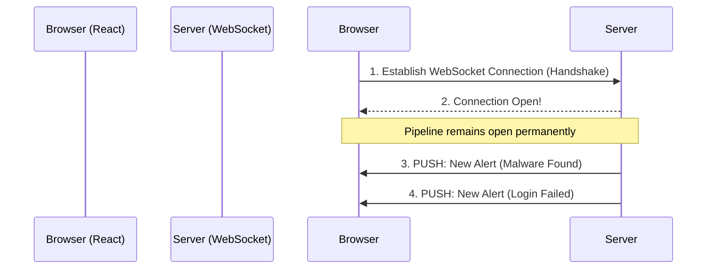

# Module 38: The React WebSockets Dashboard

## 1. What is it? (Explain from scratch for a complete beginner)
When you browse a normal website, you have to click "Refresh" to see new information. This is called polling. In a cybersecurity command center, clicking refresh is too slow—you need to see a hacker's IP pop up the exact millisecond they attack. "WebSockets" is a technology that keeps a permanent, open pipeline between the server and the browser. A React WebSockets Dashboard (used in PS26145) updates live, on its own, streaming alerts to the security analyst's screen in real-time without ever reloading the page.

## 2. Architecture / Flow (MUST include a Mermaid flowchart/diagram)


## 3. Implementation (Include Python/React code snippets)
```jsx
import React, { useState, useEffect } from 'react';

function SecurityDashboard() {
  const [alerts, setAlerts] = useState([]);

  useEffect(() => {
    // Open a WebSocket connection to our security server
    const socket = new WebSocket('ws://localhost:8080/live-alerts');

    // Listen for messages pushed from the server
    socket.onmessage = (event) => {
      const newAlert = JSON.parse(event.data);
      // Add the new alert to the top of the list
      setAlerts((prevAlerts) => [newAlert, ...prevAlerts]);
    };

    // Cleanup connection when we close the dashboard
    return () => socket.close();
  }, []); // Empty array means this runs once on load

  return (
    <div>
      <h1>Live Threat Dashboard</h1>
      <ul>
        {alerts.map((alert, index) => (
          <li key={index} style={{ color: 'red' }}>
            {alert.time}: {alert.message} (IP: {alert.ip})
          </li>
        ))}
      </ul>
    </div>
  );
}

export default SecurityDashboard;
```

## 4. Line-by-Line Explanation
1. `import React, { useState, useEffect }`: Imports React tools. `useState` holds our data, `useEffect` runs background tasks.
2. `const [alerts, setAlerts] = useState([])`: Creates an empty array to hold our live alerts.
3. `useEffect(() => { ... })`: Tells React to run this code as soon as the dashboard loads.
4. `const socket = new WebSocket(...)`: Opens the permanent two-way pipeline to the server.
5. `socket.onmessage = (event) =>`: This function fires instantly every time the server pushes data to us.
6. `JSON.parse(event.data)`: Converts the server's text data into a JavaScript object.
7. `setAlerts(...)`: Updates the React state, instantly displaying the new alert on the screen.
8. `return () => socket.close()`: Good housekeeping to close the pipeline if the user closes the tab.
9. `return ( <div>... )`: The HTML/JSX that actually draws the list of alerts in red text.

## 5. Summary
WebSockets replace the clunky "refresh to update" model with a continuous, real-time data stream. By pairing WebSockets with React, the PS26145 dashboard instantly reflects the live state of the network, giving analysts a zero-latency view of active threats.
