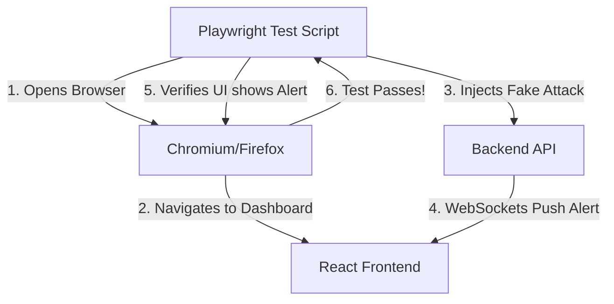

# Module 39: End-to-End Playwright Testing

## 1. What is it? (Explain from scratch for a complete beginner)
Imagine building a car and only testing the engine and the brakes separately, but never actually driving the car on a road to see if they work together. That's a bad idea. In software, "End-to-End (E2E) Testing" is like driving the car. It uses a robot to open a real web browser, click real buttons, and verify the whole system works from the database to the screen. Playwright is a modern tool created by Microsoft that writes these robotic browser tests. For CyberOS, we use Playwright to ensure the security dashboard correctly displays alerts when a simulated attack happens.

## 2. Architecture / Flow (MUST include a Mermaid flowchart/diagram)


## 3. Implementation (Include Python/React code snippets)
```javascript
// A Playwright test file (e.g., dashboard.spec.js)
const { test, expect } = require('@playwright/test');

test('Dashboard should display new alerts in real-time', async ({ page, request }) => {
  // 1. Robot opens the browser and goes to the dashboard
  await page.goto('http://localhost:3000/dashboard');

  // 2. Ensure the dashboard is empty at first
  await expect(page.locator('.alert-list')).toBeEmpty();

  // 3. Simulate an attack by hitting our backend API directly
  await request.post('http://localhost:8080/api/simulate_attack', {
    data: { type: 'SQL Injection', ip: '10.0.0.99' }
  });

  // 4. Verify the frontend instantly updates via WebSockets
  // The robot waits for the text to appear on the screen
  const newAlert = page.locator('text="SQL Injection detected from 10.0.0.99"');
  await expect(newAlert).toBeVisible({ timeout: 5000 });
});
```

## 4. Line-by-Line Explanation
1. `const { test, expect } = require('@playwright/test')`: Imports Playwright's testing tools.
2. `test(..., async ({ page, request }) => {`: Starts a new test case. `page` controls the browser, `request` can make API calls.
3. `await page.goto(...)`: Instructs the invisible robotic browser to open our dashboard URL.
4. `await expect(...).toBeEmpty()`: Checks that no alerts exist yet. If there are alerts, the test fails immediately.
5. `await request.post(...)`: We act like a hacker and trigger our backend API to simulate a threat.
6. `const newAlert = page.locator(...)`: We tell the robot to look for specific text on the screen.
7. `await expect(newAlert).toBeVisible({ timeout: 5000 })`: The ultimate test! Playwright waits up to 5 seconds for the WebSockets to push the data and React to draw it. If it sees it, the test passes.

## 5. Summary
Playwright End-to-End testing gives us ultimate confidence in our application. By simulating real user interactions in a real browser, we can guarantee that our complex chain of APIs, Message Brokers, and WebSockets actually results in a visual alert for the security team.
