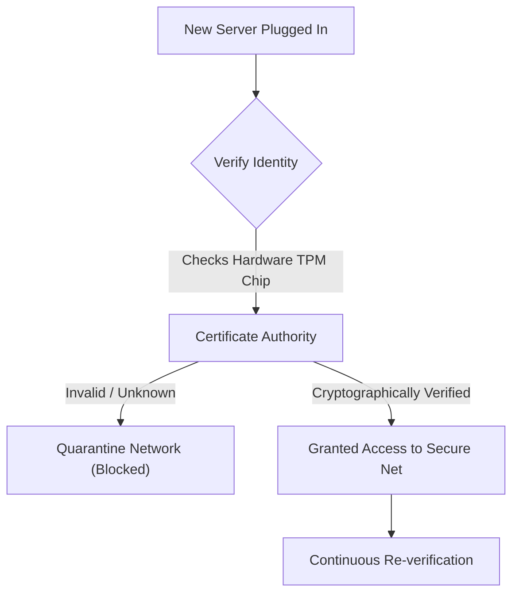

# Module 40: Zero-Trust Hardware Deployment

## 1. What is it? (Explain from scratch for a complete beginner)
In the old days of cybersecurity, the network was like a castle with a moat. If you made it inside the walls (by plugging into an Ethernet port in the building), you were trusted. "Zero-Trust" means exactly what it sounds like: Trust no one, not even devices already inside the building. In the CyberOS architecture, Zero-Trust Hardware Deployment means that before a new server, switch, or sensor is allowed to talk to the network, it must cryptographically prove its identity using secure hardware chips. Just being plugged in is no longer enough.

## 2. Architecture / Flow (MUST include a Mermaid flowchart/diagram)


## 3. Implementation (Include Python/React code snippets)
```python
import hashlib
import hmac

# Simulating a TPM (Trusted Platform Module) verification process
def verify_hardware_identity(device_id, provided_hmac, secret_key):
    # We recalculate what the HMAC should be based on the secret key
    # Only the true hardware device and the server know the secret key
    expected_hmac = hmac.new(
        key=secret_key.encode(), 
        msg=device_id.encode(), 
        digestmod=hashlib.sha256
    ).hexdigest()
    
    # Compare what the device sent vs what we calculated
    # Using hmac.compare_digest prevents timing attacks
    if hmac.compare_digest(expected_hmac, provided_hmac):
        print(f"Device {device_id} is AUTHENTICATED. Granting network access.")
        return True
    else:
        print(f"Device {device_id} is IMPOSTER. Quarantining immediately.")
        return False

# Simulated data from a device trying to connect
secret_auth_key = "super_secret_hardware_key_provisioned_at_factory"
incoming_device = "sensor_mac_00:11:22"
incoming_hmac = hmac.new(secret_auth_key.encode(), incoming_device.encode(), hashlib.sha256).hexdigest()

verify_hardware_identity(incoming_device, incoming_hmac, secret_auth_key)
```

## 4. Line-by-Line Explanation
1. `import hashlib` and `import hmac`: Imports Python libraries for creating secure, irreversible mathematical hashes.
2. `def verify_hardware_identity(...)`: A function that acts as the network gatekeeper.
3. `expected_hmac = hmac.new(...)`: The server uses the shared secret key to calculate a mathematical signature for the device ID.
4. `if hmac.compare_digest(...)`: The server safely compares the signature it calculated against the signature the hardware device presented.
5. `secret_auth_key = ...`: In real life, this key is baked into a physical TPM chip on the motherboard at the factory.
6. `incoming_hmac = ...`: Simulates the device generating its signature to prove its identity.
7. `verify_hardware_identity(...)`: Calls the function, which successfully authenticates because the keys match.

## 5. Summary
Zero-Trust Hardware Deployment assumes the network is always hostile. By forcing every single piece of hardware to cryptographically prove its identity using secure, baked-in keys (like TPMs), organizations can prevent attackers from simply plugging a rogue laptop into a wall jack and accessing sensitive data.
