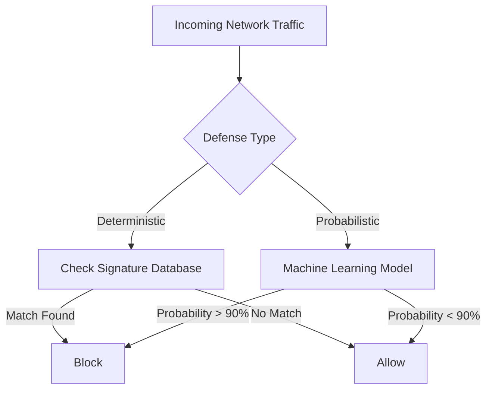

# Module 041: Deterministic vs Probabilistic Defense
## 1. What is it? (Explain from scratch for a complete beginner)
In cybersecurity, we have two main ways to catch bad guys: **Deterministic** and **Probabilistic** defense. 
- **Deterministic Defense** is like a bouncer at a club with a strict VIP list. If your name is on the "bad guys" list (like a known malware signature or a bad IP address), you are blocked. It uses strict *rules*.
- **Probabilistic Defense** is like a seasoned detective. It doesn't just look for known bad names; it looks at *behavior*. If someone is sweating, wearing a ski mask, and carrying a crowbar, the detective calculates a *probability* that this person is up to no good, even if they've never been seen before. This relies on Machine Learning (ML).

## 2. Architecture / Logic


## 3. Implementation
```python
def deterministic_defense(ip_address):
    bad_ips = ["192.168.1.50", "10.0.0.99"]
    if ip_address in bad_ips:
        return "Blocked by Rule"
    return "Allowed"

def probabilistic_defense(ml_model, traffic_features):
    # Predict the probability of being malicious
    malicious_probability = ml_model.predict_proba(traffic_features)[0][1]
    if malicious_probability > 0.85:
        return f"Blocked by ML (Confidence: {malicious_probability*100}%)"
    return "Allowed"
```

## 4. Line-by-Line Explanation
- `bad_ips = [...]`: We define a hardcoded list of known threats for deterministic defense.
- `if ip_address in bad_ips`: This is the strict rule. It either matches exactly, or it doesn't.
- `malicious_probability = ml_model.predict_proba(traffic_features)[0][1]`: Here, an ML model looks at the traffic's features and outputs a percentage (probability) of it being an attack.
- `if malicious_probability > 0.85`: Instead of an exact match, we use a threshold (85%). If the model is confident enough, we block it.

## 5. Summary
Deterministic defense is highly accurate for *known* threats but fails against new, unseen attacks (zero-days). Probabilistic defense uses AI to guess if something is bad based on its behavior, allowing us to catch brand-new attacks, though it occasionally makes mistakes (false positives).
