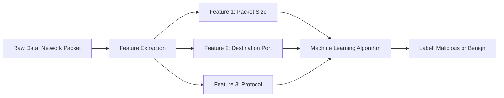

# Module 042: Machine Learning Basics (Features & Labels)
## 1. What is it? (Explain from scratch for a complete beginner)
When we teach a computer to find malware using Machine Learning, we have to speak its language. We do this using **Features** and **Labels**.
- **Features** are the characteristics or clues. Imagine you are trying to guess if an animal is a dog or a cat. The features would be: *Weight, Ear Shape, Barking (Yes/No)*. In cybersecurity, features are things like: *File Size, Network Port, Number of failed logins*.
- **Labels** are the answers. It's what we are trying to predict. In our animal example, the label is "Dog" or "Cat". In cybersecurity, the label is usually "Malicious" or "Benign" (safe).

## 2. Architecture / Logic


## 3. Implementation
```python
import pandas as pd

# Creating a dataset of network traffic
data = {
    'Packet_Size': [500, 1500, 64, 9000],          # Feature 1
    'Dest_Port': [80, 443, 22, 4444],              # Feature 2
    'Failed_Logins': [0, 0, 5, 0],                 # Feature 3
    'Label': ['Benign', 'Benign', 'Malicious', 'Malicious'] # The Answer
}

df = pd.DataFrame(data)

# Separating Features (X) and Labels (y)
X_features = df[['Packet_Size', 'Dest_Port', 'Failed_Logins']]
y_labels = df['Label']

print("Features (Clues):\n", X_features)
print("\nLabels (Answers):\n", y_labels)
```

## 4. Line-by-Line Explanation
- `data = {...}`: We create a dictionary containing our columns. Three columns are our features, and one is our label.
- `pd.DataFrame(data)`: We convert this dictionary into a Pandas DataFrame, which is basically a virtual Excel spreadsheet.
- `X_features = df[['Packet_Size', 'Dest_Port', 'Failed_Logins']]`: We create a new variable `X` that holds *only* the clues.
- `y_labels = df['Label']`: We create a variable `y` that holds *only* the answers.

## 5. Summary
To do machine learning, we need historical data. We extract measurable properties called **Features** (the X variables) and pair them with the correct answers called **Labels** (the y variable). The ML algorithm studies the relationship between the features and the labels so it can predict labels for new data.
