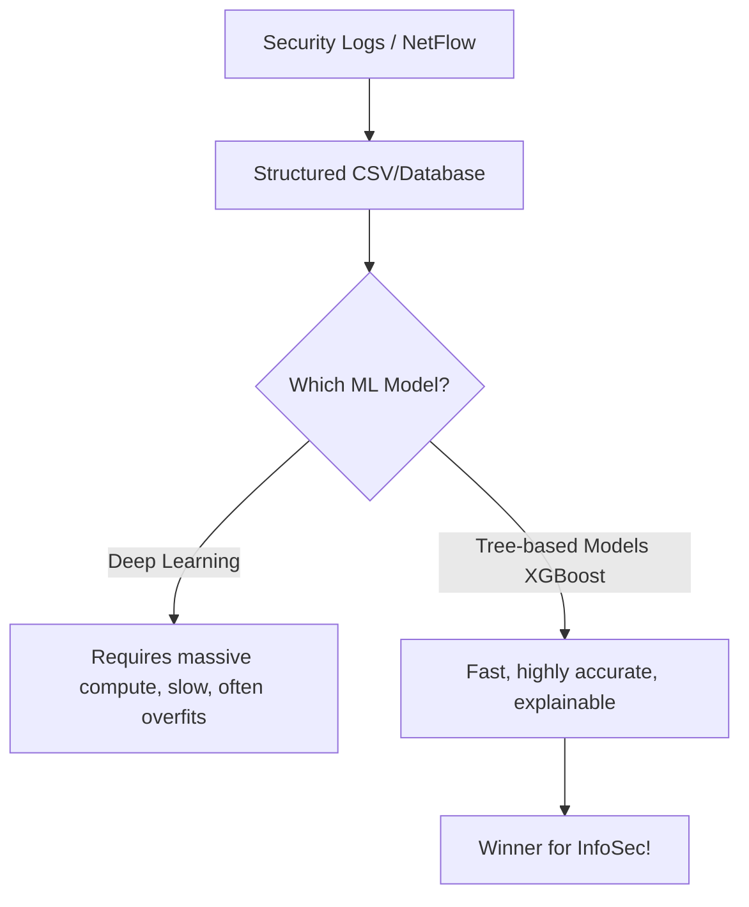

# Module 043: Tabular Data Supremacy in InfoSec
## 1. What is it? (Explain from scratch for a complete beginner)
When you hear about Artificial Intelligence, you often hear about Deep Learning (Neural Networks) doing amazing things like recognizing faces or writing essays. But in Cybersecurity (InfoSec), standard **Tabular Data** models (like Random Forests and XGBoost) usually beat Deep Learning!
Tabular data is just data that fits nicely into rows and columns, like a CSV file or an Excel spreadsheet. Network logs, firewall events, and user logins are naturally tabular. Standard ML models are faster, use less memory, and are often much more accurate for this specific type of data than massive deep neural networks.

## 2. Architecture / Logic


## 3. Implementation
```python
import pandas as pd
from sklearn.ensemble import RandomForestClassifier

# Loading tabular InfoSec data (rows and columns)
tabular_data = pd.DataFrame({
    'bytes_sent': [450, 89000, 120, 5000000],
    'duration_sec': [1, 5, 0.1, 3600],
    'is_malware': [0, 1, 0, 1]
})

X = tabular_data[['bytes_sent', 'duration_sec']]
y = tabular_data['is_malware']

# Using a standard Tree-based model (supreme for tabular data)
model = RandomForestClassifier(n_estimators=10)
model.fit(X, y)

print("Model trained successfully on tabular data!")
```

## 4. Line-by-Line Explanation
- `tabular_data = pd.DataFrame(...)`: We create structured, row-and-column data representing network sessions.
- `X = ...` and `y = ...`: We split the tabular data into our features (bytes sent, duration) and our label (is_malware).
- `RandomForestClassifier(n_estimators=10)`: We initialize a Random Forest, which is a classic tabular data model made of multiple decision trees.
- `model.fit(X, y)`: The model learns the patterns in the spreadsheet instantly, without the need for complex, heavy Deep Learning mathematics.

## 5. Summary
While Neural Networks are great for images and text, InfoSec data is mostly tabular (logs, flows, events). For tabular data, tree-based algorithms like XGBoost and Random Forest are supreme because they are faster, require less tuning, and provide excellent accuracy.
