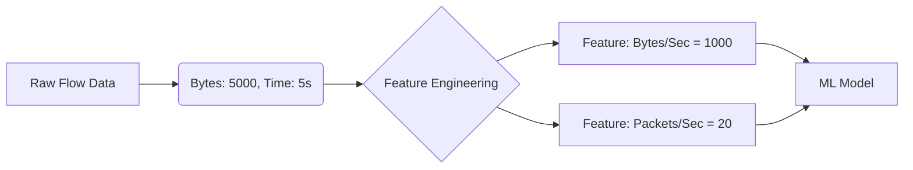

# Module 044: Feature Engineering for Network Flows
## 1. What is it? (Explain from scratch for a complete beginner)
A network flow is just a record of a conversation between two computers (e.g., Computer A talked to Computer B for 5 minutes and sent 100 packets). But raw flows aren't always useful for AI. 
**Feature Engineering** is the art of taking raw data and doing math on it to create *better, smarter clues* (features) for our Machine Learning model. For example, instead of just giving the model "Total Bytes" and "Total Time", we can engineer a new feature: "Bytes per Second". This new feature might immediately expose a data exfiltration attack!

## 2. Architecture / Logic


## 3. Implementation
```python
import pandas as pd

# Raw Network Flow Data
flows = pd.DataFrame({
    'source_ip': ['10.0.0.1', '10.0.0.2'],
    'total_bytes': [15000, 8000000],
    'total_packets': [15, 8000],
    'duration_seconds': [5, 2]
})

# --- Feature Engineering ---
# 1. Calculate Bytes per Second
flows['bytes_per_sec'] = flows['total_bytes'] / flows['duration_seconds']

# 2. Calculate Average Packet Size
flows['avg_packet_size'] = flows['total_bytes'] / flows['total_packets']

print("Engineered Features:\n", flows[['bytes_per_sec', 'avg_packet_size']])
```

## 4. Line-by-Line Explanation
- `flows = pd.DataFrame(...)`: We start with raw, un-optimized data directly from our network router or firewall.
- `flows['bytes_per_sec'] = ...`: We create a brand new column. We divide `total_bytes` by `duration_seconds`. If this number is extremely high, it might indicate a file download or data theft.
- `flows['avg_packet_size'] = ...`: We create another feature. If average packet size is very small, it might be a ping sweep or port scan.

## 5. Summary
Feature Engineering is the most important step in Machine Learning. By mathematically combining and transforming raw network data into meaningful metrics (like rates, averages, and ratios), we make it much easier for the AI to spot malicious behavior.
