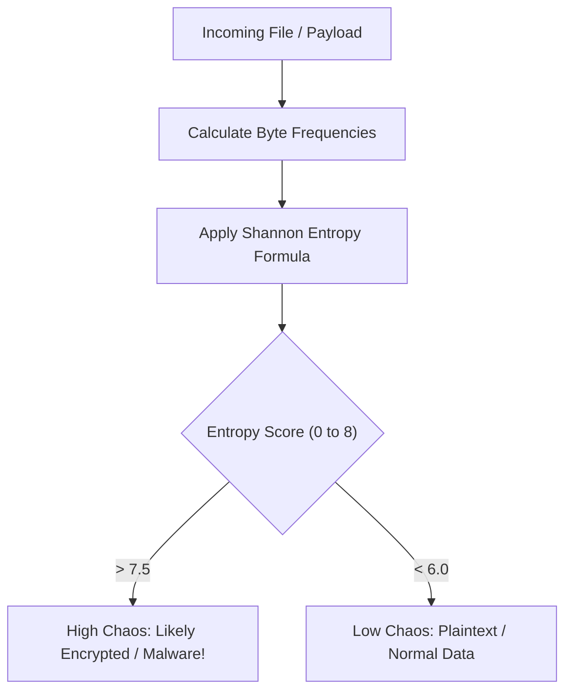

# Module 045: Entropy and Mathematics in Detection
## 1. What is it? (Explain from scratch for a complete beginner)
How can you tell if a file contains plain text or if it's an encrypted ransomware payload? You can use **Entropy**!
In cybersecurity, entropy is a mathematical measurement of *randomness* or *chaos* in a piece of data. 
- Normal English text has low entropy (predictable letters, lots of spaces).
- Encrypted data or compressed malware has very **high entropy** (looks completely random).
By measuring the entropy of network packets or files, we can mathematically detect if someone is trying to hide malicious code.

## 2. Architecture / Logic
The formula for Shannon Entropy (H) is:
$$ H(X) = - \sum_{i=1}^{n} P(x_i) \log_2 P(x_i) $$
Where $P(x_i)$ is the probability (frequency) of a specific byte appearing in the data.



## 3. Implementation
```python
import math
from collections import Counter

def calculate_entropy(data_string):
    # Count how many times each character appears
    frequencies = Counter(data_string)
    length = len(data_string)
    
    entropy = 0.0
    for count in frequencies.values():
        probability = count / length
        # Shannon Entropy math
        entropy -= probability * math.log2(probability)
        
    return entropy

# Test cases
normal_text = "Hello world, this is a normal sentence."
encrypted_malware = "x8f\x9a\x02\x1b\x7f\xa3\xcc\x4d\xe1\x55\x89"

print(f"Normal text entropy: {calculate_entropy(normal_text):.2f}")
print(f"Encrypted malware entropy: {calculate_entropy(encrypted_malware):.2f}")
```

## 4. Line-by-Line Explanation
- `Counter(data_string)`: This counts the occurrences of every single byte/character in the data.
- `probability = count / length`: We find the percentage chance of any given byte appearing.
- `entropy -= probability * math.log2(probability)`: This is the Shannon Entropy formula. It sums up the unpredictability of every byte.
- When applied to `normal_text`, the score is low (around 3.0 - 4.0) because letters like 'e' and ' ' (space) are predictable. The `encrypted_malware` scores much higher because every byte is totally random.

## 5. Summary
Entropy is a powerful mathematical tool in cybersecurity. By calculating how "random" a file or network payload is, defenders can easily spot encrypted communication, packed malware, or ransomware without needing to know the actual contents of the file.
