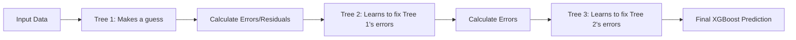

# Module 046: eXtreme Gradient Boosting (XGBoost)
## 1. What is it? (Explain from scratch for a complete beginner)
**XGBoost** stands for eXtreme Gradient Boosting. It is one of the most powerful Machine Learning algorithms in the world for tabular data.
Imagine you have a team of detectives. The first detective looks at the evidence and makes a guess, but makes some mistakes. The second detective looks *only* at the mistakes the first one made and tries to fix them. The third looks at the second's mistakes, and so on. 
XGBoost builds hundreds of small Decision Trees in a sequence, where each new tree specifically tries to correct the errors of the previous trees.

## 2. Architecture / Logic


## 3. Implementation
```python
import xgboost as xgb
import numpy as np

# Feature 1: Payload size, Feature 2: Entropy
X_train = np.array([[500, 3.2], [1500, 7.9], [64, 2.1], [8000, 7.8]])
# 0 = Benign, 1 = Malware
y_train = np.array([0, 1, 0, 1]) 

# Initialize the XGBoost Classifier
model = xgb.XGBClassifier(n_estimators=10, learning_rate=0.1)

# Train the model (Building the sequential trees)
model.fit(X_train, y_train)

# Test with a new network flow (Size=7500, Entropy=7.95)
new_flow = np.array([[7500, 7.95]])
prediction = model.predict(new_flow)

print("Prediction (0=Safe, 1=Malware):", prediction[0])
```

## 4. Line-by-Line Explanation
- `import xgboost as xgb`: We import the XGBoost library.
- `X_train` and `y_train`: We set up some dummy training data. Notice how malware (1) has high entropy.
- `xgb.XGBClassifier(n_estimators=10, learning_rate=0.1)`: We create the model. `n_estimators=10` means it will build 10 trees in a sequence. `learning_rate` controls how aggressively each tree corrects the last one.
- `model.fit(X_train, y_train)`: The algorithm trains, building trees step-by-step to minimize prediction error.
- `model.predict(new_flow)`: We ask the fully trained team of trees to classify a new, unseen network packet.

## 5. Summary
XGBoost is an ensemble learning method that uses sequential decision trees. Because it explicitly focuses on correcting its own past mistakes, it achieves incredibly high accuracy and is a favorite algorithm for cybersecurity data scientists detecting anomalies in network traffic.
