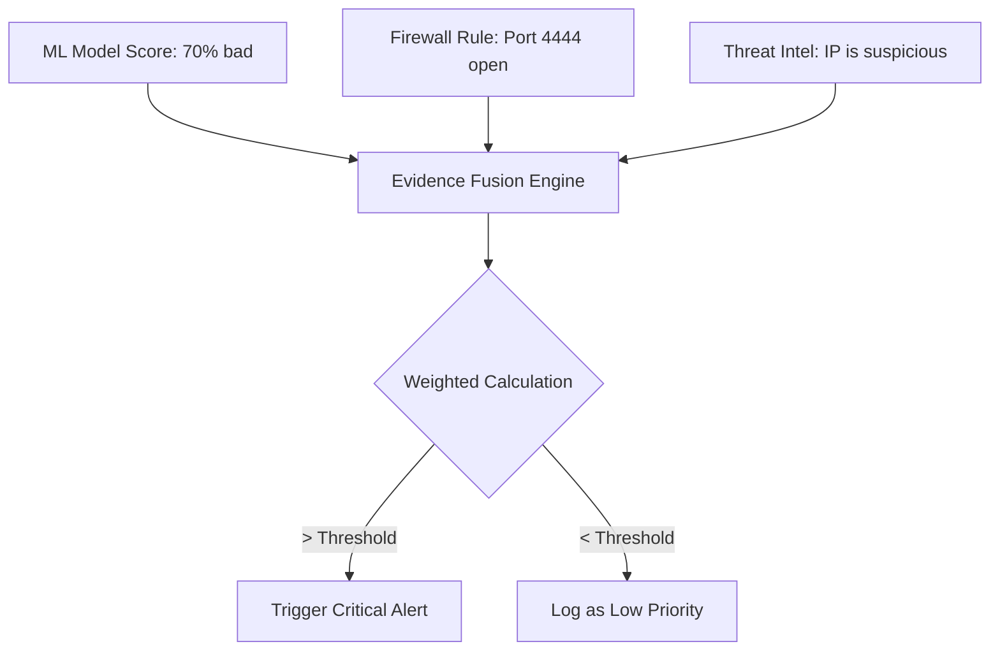

# Module 047: Evidence Fusion Engine
## 1. What is it? (Explain from scratch for a complete beginner)
In a real Security Operations Center (SOC), you don't rely on just one tool. You might have an Antivirus, a Firewall, an Intrusion Detection System (IDS), and a Machine Learning model. 
An **Evidence Fusion Engine** is a central brain that takes the alerts (evidence) from all these different tools and mathematically fuses them together to make one final, highly accurate decision. It weighs the evidence based on how much it trusts each tool.

## 2. Architecture / Logic


## 3. Implementation
```python
def fusion_engine(ml_score, rule_matched, intel_flagged):
    # Weights define how much we trust each source
    weight_ml = 0.4
    weight_rule = 0.3
    weight_intel = 0.3
    
    # Normalize inputs to 0.0 or 1.0 (except ML which is already a probability)
    rule_score = 1.0 if rule_matched else 0.0
    intel_score = 1.0 if intel_flagged else 0.0
    
    # Calculate fused confidence score
    fused_score = (ml_score * weight_ml) + (rule_score * weight_rule) + (intel_score * weight_intel)
    
    print(f"Fused Threat Score: {fused_score:.2f}")
    
    if fused_score > 0.75:
        return "CRITICAL ALERT: Isolate Machine"
    return "MONITOR: Not enough evidence"

# Scenario: ML is suspicious, Rule didn't trigger, Threat Intel knows the IP is bad
action = fusion_engine(ml_score=0.85, rule_matched=False, intel_flagged=True)
print("Action Taken:", action)
```

## 4. Line-by-Line Explanation
- `weight_... = ...`: We assign weights. If they add up to 1.0 (100%), it forms a weighted average.
- `rule_score = 1.0 if rule_matched else 0.0`: We convert Boolean (True/False) alerts into numbers so we can do math on them.
- `fused_score = (ml_score * weight_ml) + ...`: The Fusion Engine multiplies each piece of evidence by its weight and adds them up.
- `if fused_score > 0.75:`: We only isolate the machine if the combined evidence crosses a high threshold, preventing false alarms.

## 5. Summary
An Evidence Fusion Engine solves the problem of "alert fatigue." By combining multiple weak signals (a slightly suspicious ML score, a generic threat intel flag) using weighted math, it creates a single, high-confidence alert that security analysts can actually trust.
