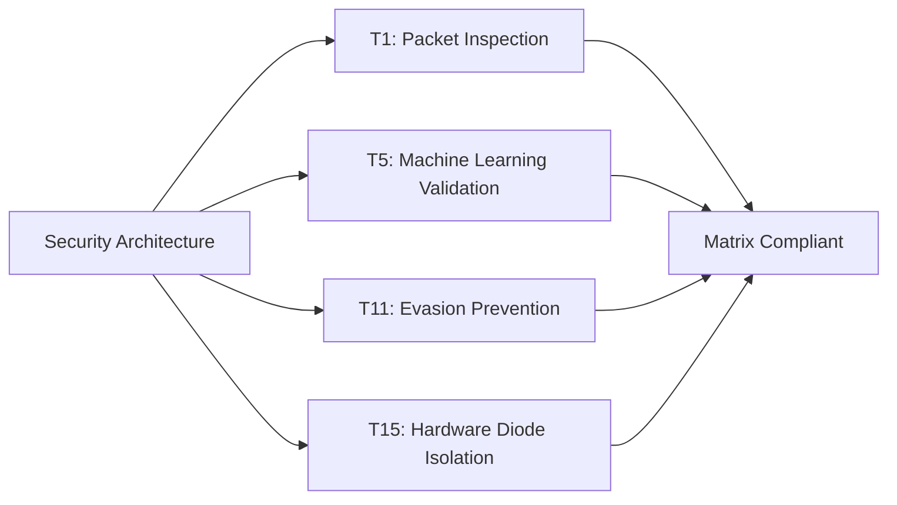

# Module 048: The T1-T15 Requirements Matrix
## 1. What is it? (Explain from scratch for a complete beginner)
When building a security architecture, you can't just guess if you are secure. The **T1-T15 Requirements Matrix** (a conceptual framework similar to MITRE ATT&CK or strict compliance frameworks) is a checklist of 15 critical technical requirements your defense system must meet. 
These requirements range from T1 (Must inspect all inbound traffic) to T15 (Must have zero physical connection to the outside world - hardware diodes). Using a matrix ensures there are no blind spots in your defense grid.

## 2. Architecture / Logic


## 3. Implementation
```python
# A dictionary representing the T1-T15 validation matrix
compliance_matrix = {
    "T1_Packet_Inspection": True,
    "T5_ML_Detection": True,
    "T11_Evasion_Protection": False, # Uh oh, we are failing this requirement!
    "T15_Physical_Isolation": True
}

def validate_architecture(matrix):
    failed_controls = []
    for requirement, status in matrix.items():
        if status == False:
            failed_controls.append(requirement)
            
    if failed_controls:
        print(f"SYSTEM NON-COMPLIANT. Fix the following: {failed_controls}")
    else:
        print("System fully meets the T1-T15 Requirements Matrix.")

validate_architecture(compliance_matrix)
```

## 4. Line-by-Line Explanation
- `compliance_matrix = {...}`: We define a JSON-like structure that tracks whether our network meets the specific technical requirements (T1 through T15).
- `for requirement, status in matrix.items():`: We loop through every requirement in the matrix.
- `if status == False:`: We check if any requirement is currently failing.
- `failed_controls.append(requirement)`: If it's failing, we add it to a list of violations that the security engineering team needs to fix immediately.

## 5. Summary
The T1-T15 Requirements Matrix is an engineering blueprint. It turns abstract security concepts into a strict, auditable checklist, ensuring that systems possess layered defenses, ML capabilities, and physical safeguards without leaving dangerous gaps.
