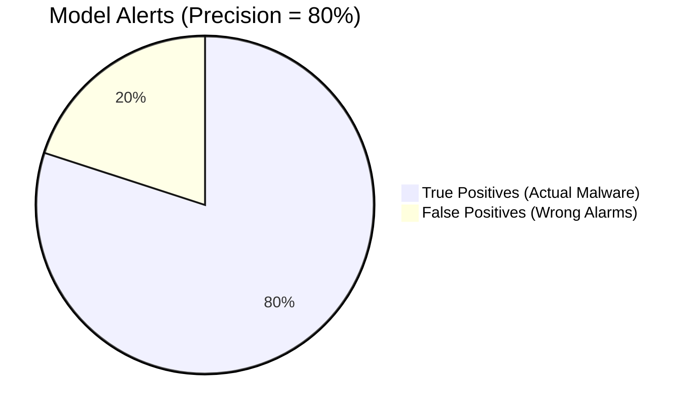

# Module 049: True Positives and Model Precision
## 1. What is it? (Explain from scratch for a complete beginner)
When evaluating an ML model, we can't just ask "Is it accurate?" We need to be specific. 
- **True Positive (TP):** The model caught actual malware. (YAY!)
- **False Positive (FP):** The model flagged a normal file as malware. (Annoying for users!)
- **Precision** is a specific math formula: Out of everything the model *claimed* was malware, what percentage was *actually* malware? If precision is low, your security team will waste all day investigating False Positives.

## 2. Architecture / Logic
$$ Precision = \frac{True Positives}{True Positives + False Positives} $$



## 3. Implementation
```python
from sklearn.metrics import precision_score, confusion_matrix

# True answers (1 = Malware, 0 = Safe)
actual_reality = [1, 0, 0, 1, 1, 0]

# What our ML model guessed
model_guesses  = [1, 1, 0, 1, 0, 0]

# Calculate Precision
# The model guessed Malware for indices 0, 1, 3. 
# Actual reality for those indices is 1, 0, 1.
# So it got 2 True Positives, and 1 False Positive (index 1).
precision = precision_score(actual_reality, model_guesses)

# Extract TP and FP
tn, fp, fn, tp = confusion_matrix(actual_reality, model_guesses).ravel()

print(f"True Positives: {tp}")
print(f"False Positives: {fp}")
print(f"Model Precision: {precision * 100:.1f}%")
```

## 4. Line-by-Line Explanation
- `actual_reality`: This is the ground truth. We have 3 malware files and 3 safe files.
- `model_guesses`: The model guessed that the first, second, and fourth files were malware. 
- Notice the second file: Reality was `0`, but the model guessed `1`. That is a **False Positive**.
- `precision_score(...)`: This calculates the math for us. The model yelled "Malware!" 3 times. 2 times it was right (TP), 1 time it was wrong (FP). Precision = 2 / (2 + 1) = 66.7%.

## 5. Summary
In cybersecurity, Precision is critical. A model with low precision generates too many False Positives (alert fatigue). By tracking True Positives vs False Positives, engineers can tune their XGBoost models to only flag traffic when they are absolutely certain.
