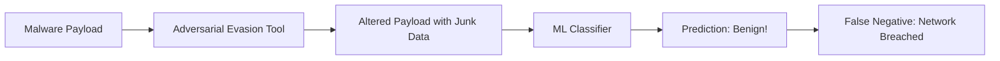

# Module 050: The T11 False Negative (Evasion)
## 1. What is it? (Explain from scratch for a complete beginner)
A **False Negative (FN)** is the worst-case scenario in cybersecurity: Malware enters the network, and the security model says "Looks safe to me!" (Negative).
In the T11 requirement, we specifically worry about **Evasion Attacks** (Adversarial ML). This is when a hacker purposefully slightly alters their malware (like adding a few blank bytes) so that it still does damage, but the Machine Learning model's math gets confused and misclassifies it as benign.

## 2. Architecture / Logic


## 3. Implementation
```python
# Simulating an Evasion Attack on a basic ML check
def simple_ml_model(payload_size_bytes):
    # Model learned that payloads over 1000 bytes are usually safe (like images)
    if payload_size_bytes > 1000:
        return "Benign (Safe)"
    else:
        return "Malware!"

# Hacker's original malware is small (500 bytes)
original_malware_size = 500
print("Original Attack:", simple_ml_model(original_malware_size)) # Caught!

# Hacker evades detection by padding malware with 600 bytes of zeros
evasion_padding = 600
altered_malware_size = original_malware_size + evasion_padding

print("Evasion Attack:", simple_ml_model(altered_malware_size)) # False Negative!
```

## 4. Line-by-Line Explanation
- `simple_ml_model(payload_size_bytes)`: Imagine a highly simplified ML model that thinks small files are exploits and large files are safe documents.
- The `original_malware_size` is 500 bytes. The model successfully flags it as "Malware!"
- `evasion_padding = 600`: The attacker figures out the model's blind spot. They add 600 bytes of useless data (zeros) to their malware.
- The `altered_malware_size` is now 1100 bytes. The model outputs "Benign". This is a **False Negative** caused by evasion.

## 5. Summary
Machine Learning is not bulletproof. Hackers use evasion techniques (Adversarial AI) to manipulate features—like changing file sizes, adjusting entropy, or spoofing ports—to trick models into generating False Negatives. Defenders must constantly retrain models on adversarial examples to satisfy requirement T11.
