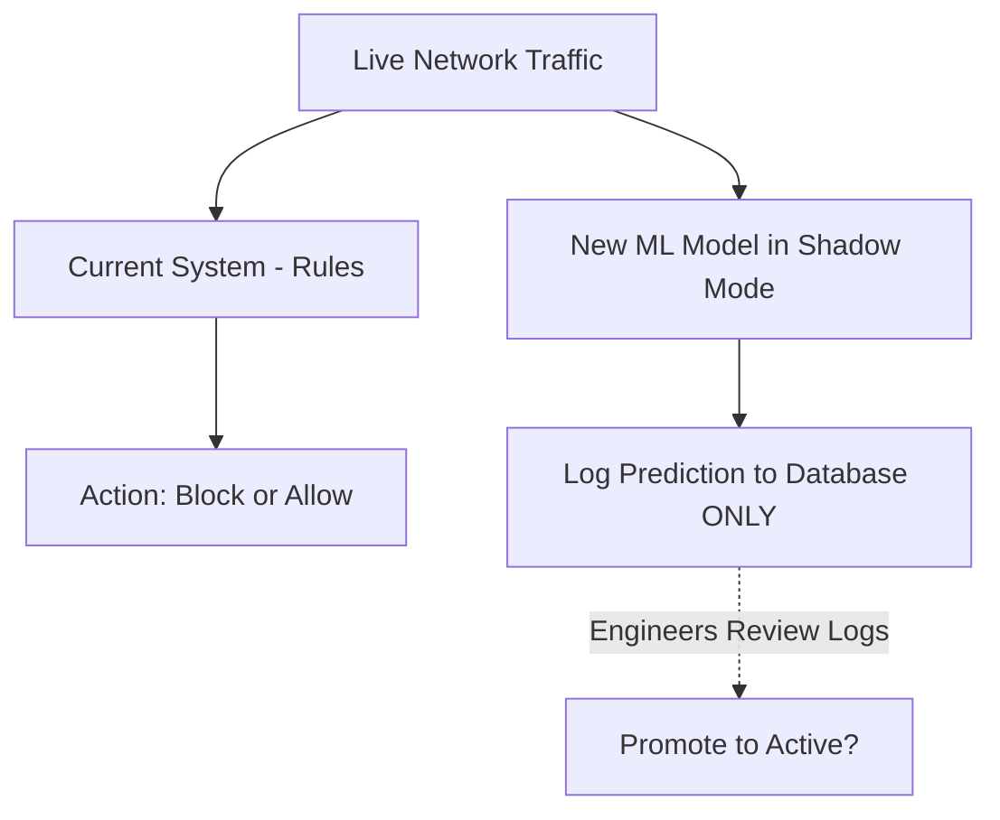

# Module 052: Model Governance & Shadow Mode
## 1. What is it? (Explain from scratch for a complete beginner)
If you train a new ML model to block hackers, you can't just plug it into your network and turn it on immediately. What if it accidentally blocks the CEO's laptop? 
**Model Governance** is the process of safely deploying AI. We use **Shadow Mode** (also called Dark Launching). The new model runs live on real network traffic and makes predictions, but it is *muted*. It only writes its predictions to a log file. Security engineers analyze the logs to ensure it's safe before giving it the power to actually block traffic.

## 2. Architecture / Logic


## 3. Implementation
```python
def active_defense(traffic):
    # Standard rule-based firewall
    return "Allowed by Firewall"

def shadow_mode_model(traffic, is_active=False):
    # The new Machine Learning model
    prediction = "Block (Malware detected!)"
    
    if is_active:
        # If fully deployed, actually take action
        return prediction
    else:
        # SHADOW MODE: Just log it, don't interfere
        print(f"[SHADOW LOG] Model would have done: {prediction}")
        return None

# Processing a network packet
packet = "Normal Web Browsing"

# The active system processes traffic normally
firewall_action = active_defense(packet)
print("Actual Action Taken:", firewall_action)

# The new model evaluates the same traffic silently
shadow_mode_model(packet, is_active=False)
```

## 4. Line-by-Line Explanation
- `active_defense()`: The current legacy system is the only thing allowed to actually interact with the traffic.
- `is_active=False`: By default, our new ML model is placed in Shadow Mode.
- `if is_active:`: This is the governance switch. It prevents the ML model from returning a block command.
- `print("[SHADOW LOG]...")`: Instead of blocking, it simply logs what it *would* have done. Engineers can review this later to check for False Positives.

## 5. Summary
Model Governance and Shadow Mode prevent catastrophic AI failures in production. By allowing a new ML model to evaluate live traffic without the authority to take action, defenders can safely validate its precision and recall in the real world before flipping the switch to "Active."
