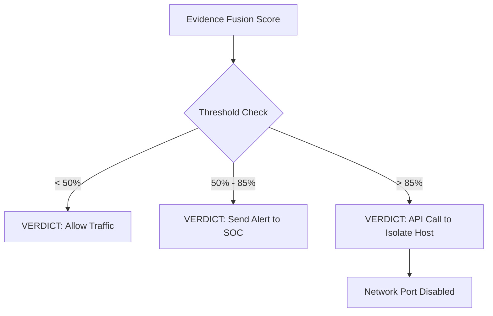

# Module 053: The Final Verdict
## 1. What is it? (Explain from scratch for a complete beginner)
**The Final Verdict** is the ultimate output of the entire cybersecurity pipeline. 
Traffic entered the network, features were engineered, XGBoost analyzed it, the Evidence Fusion Engine weighed the scores, and it passed Shadow Mode. Now, the system must make an automated, irreversible decision: *Allow*, *Alert*, or *Isolate*. The Final Verdict is where data science turns into kinetic network action.

## 2. Architecture / Logic


## 3. Implementation
```python
import requests

def execute_final_verdict(fusion_score, host_ip):
    print(f"--- Evaluating Final Verdict for {host_ip} ---")
    
    if fusion_score < 0.50:
        print("Verdict: ALLOW. Traffic is benign.")
        
    elif 0.50 <= fusion_score < 0.85:
        print("Verdict: ALERT. Creating ticket for SOC Analyst.")
        # Trigger an email or Slack alert here
        
    else:
        print("Verdict: ISOLATE. Critical threat detected!")
        # Simulate an API call to a Cisco/Palo Alto switch to kill the port
        api_payload = {"ip": host_ip, "action": "quarantine"}
        print(f"[API CALL] Sent to Network Controller: {api_payload}")
        return "Host Isolated"

# Simulating the end of the pipeline
execute_final_verdict(fusion_score=0.92, host_ip="10.0.5.50")
```

## 4. Line-by-Line Explanation
- `execute_final_verdict(...)`: The function that takes the final mathematical score from the fusion engine.
- `if fusion_score < 0.50:`: Low scores are allowed through immediately. Minimal latency.
- `elif ... < 0.85:`: Medium scores generate alerts. The system isn't confident enough to break the user's connection, so it asks a human to look.
- `else:`: High scores (>85%) trigger automated response.
- `api_payload = ...`: The python script actually reaches out to network hardware (like a firewall or switch) via an API to physically disconnect the infected machine.

## 5. Summary
The Final Verdict is the culmination of Deterministic and Probabilistic defense. It takes the mathematical certainty of the ML models and translates it into automated, decisive action to protect the network. It proves that ML in InfoSec is not just about logging alerts—it is about active, automated defense.
