# CyberOS — MASTER ENGINEERING, VALIDATION & EVIDENCE DOSSIER

## 1. Executive Summary

| CyberOS | TEST SCENARIOS | FINAL REGRESSION | F1 SCORE | THROUGHPUT |
| :--- | :--- | :--- | :--- | :--- |
| **FUNCTIONALLY VERIFIED** | **15** | **11 TP / 3 TN / 0 FP / 1 FN** | **95.6%** | **~3,120 FLOWS/s** |

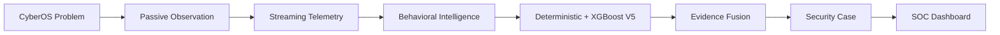

## 2. CyberOS Problem
**Core Objective:** Detect, classify, and score cyber threats in a one-directional IP traffic stream using purely passive metadata.
**Constraint:** No return path, no active probing, no payload decryption.

## 3. Solution Overview
A distributed, dual-engine (Deterministic + ML) network detection and response (NDR) pipeline. It aggregates Zeek telemetry into temporal host-behavioral windows and fuses explicit protocol violations with XGBoost-derived behavioral anomalies.

## 4. Project Evolution

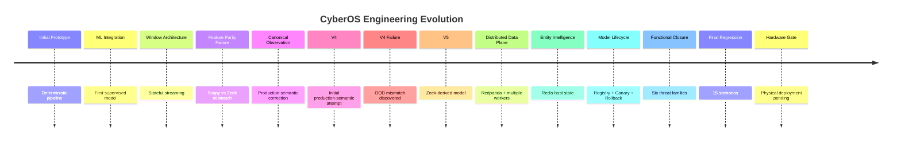

## 5. Architecture Evolution

### Version A (Initial Offline)
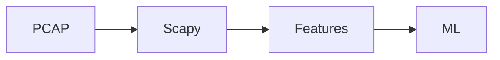

### Version B (Streaming Alpha)
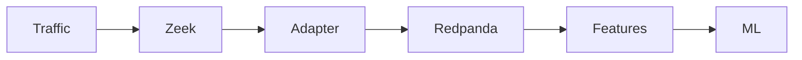

### Final (Distributed Hybrid)
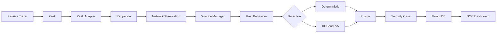

## 6. Production Architecture

```mermaid
flowchart LR
    N[Protected Network] --> P[Passive Mirror / TAP / Data Diode]
    P --> Z[Zeek Sensor] --> A[Zeek Adapter] --> K[Redpanda]
    K --> O[NetworkObservation] --> W[Window Manager] --> R[Redis Host Behaviour]
    R --> F[Feature Engine]
    F --> D[Deterministic Detection]
    F --> M[XGBoost V5]
    D --> X[Evidence Fusion]
    M --> X --> C[Security Case] --> DB[MongoDB] --> UI[Live SOC Dashboard]

    classDef boundary fill:#f9f9f9,stroke:#d92d20,stroke-width:4px,stroke-dasharray: 5 5;
    class P boundary
```
*Note: The dashed red boundary represents the **ONE-WAY / PASSIVE BOUNDARY** with **NO ACTIVE RETURN PATH**.*

## 7. Data Flow

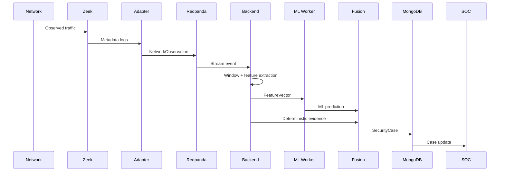

## 8. Feature Engineering

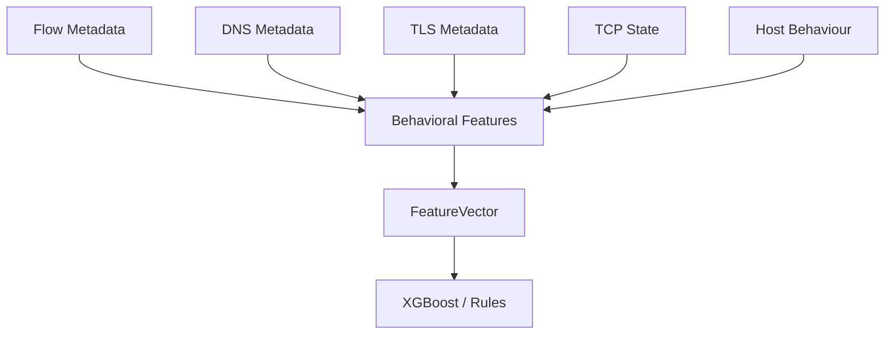

## 9. Deterministic Detection

| Detector | Initial State | Problem | Fix | Validation | Current Status |
| :--- | :--- | :--- | :--- | :--- | :--- |
| `ddos_stat_v1` | Naive rate limits | Missed spoofed IPs | Added source entropy | T3/T4/T15 | VERIFIED |
| `beacon_stateful_v2` | Single-flow | Missed temporal | Redis cross-window state | T5/T6 | VERIFIED |
| `dga_lexical_v1` | Simple regex | Missed modern DGA | Shannon entropy | T7 | VERIFIED |
| `tls_behavioral_v1` | Ignored | Payload reliance | JA3/JA4 + Byte timing | T9 | VERIFIED |
| `scan_v2` | SYN count | False positive on CDNs | TCP packet depth checks | T10/T14 | VERIFIED |
| `exfil_v1` | Global bandwidth | No host context | Host-specific byte ratio | T12 | VERIFIED |
| `slow_http_v1` | Missing | Missed Slowloris | Concurrent trickle logic | T13 | VERIFIED |

## 10. ML Evolution

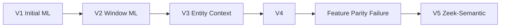

| Model | Training Representation | Production Compatibility | Result |
| :--- | :--- | :--- | :--- |
| V4 | Scapy | Mismatch | Failed on Zeek data |
| V5 | Zeek-derived | Aligned | Validated |

## 11. XGBoost V5 Metrics

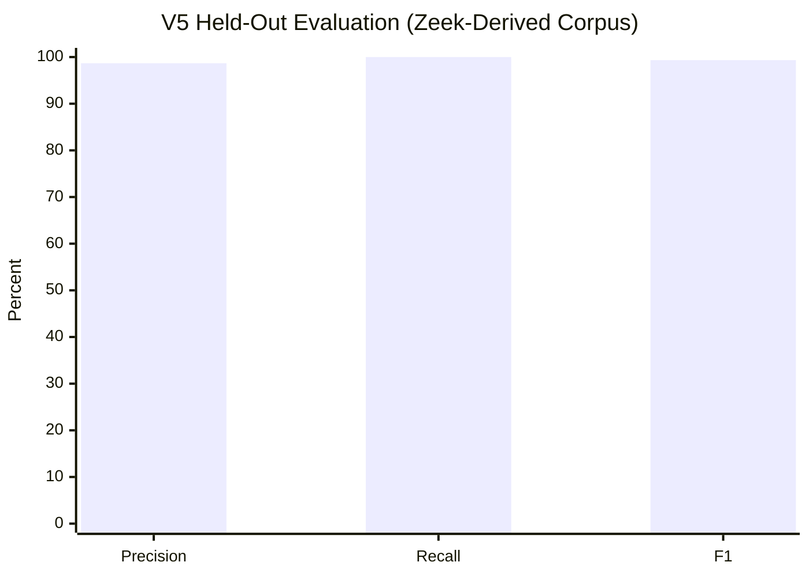

| Metric | Value | Source | Scope |
| :--- | :--- | :--- | :--- |
| Precision | 98.6876% | `v5_evaluation.json` | Held-out Zeek-derived |
| Recall | 100.000% | `v5_evaluation.json` | Held-out Zeek-derived |
| F1 | 99.3394% | `v5_evaluation.json` | Held-out Zeek-derived |

## 12. Threat Families

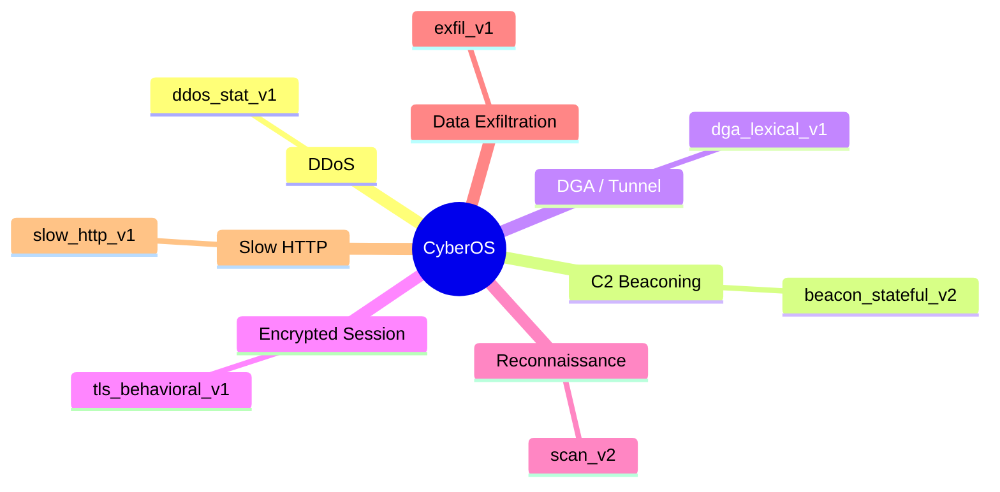

## 13. Evidence Fusion
Fusion logic processes both ML Probabilities and Rule Evidence to emit a final Security Case, preventing ML from causing alerts without contextual threshold evidence.

## 14. Dashboard
Live SOC Dashboard leverages WebSockets to update cases in real-time, displaying threat badges, evidence arrays, and ML model versions.

## 15. Engineering Failures (The Failure Wall)

* **Scapy vs Zeek Feature Mismatch**: Training byte counts were L2 (Scapy: 13600), production was L3 (Zeek: 1500). **Fix:** Migrated training pipeline to Zeek semantics.
* **TCP History Parse Failure**: Python `sum()` misread Zeek's string-based TCP flag history. **Fix:** Refactored `NetworkObservation` parser.
* **Missing SlowHTTP Detector**: V5 missed Slowloris due to its low volume. **Fix:** Introduced deterministic `slow_http_v1` targeting concurrent trickle bytes.
* **High-Fanout False Positives**: Legitimate web browsers hit `scan_v2` due to CDN connections. **Fix:** Added `orig_packets` depth check to ignore established flows.

## 16. Feature Parity Visual

**BEFORE (The Failure)**
*   `byte_count` &rarr; Scapy: 13600 | Zeek: 1500 *(Mismatch)*
*   `packet_size_mean` &rarr; Scapy: 45.33 | Zeek: 5.0 *(Mismatch)*

**AFTER (The Fix)**
*   `CanonicalObservation` applied to both Training and Production &rarr; **ALIGNED**

## 17. Validation Taxonomy

| Label | Meaning |
| :--- | :--- |
| 🟦 UNIT | Component tested in isolation |
| 🟩 PCAP REPLAY | Raw packets replayed into Zeek |
| 🟢 END-TO-END | Containerized pipeline processing live stream |
| 🟨 LIVE INTERFACE | Sniffing a real network adapter |
| 🟥 PHYSICAL HARDWARE| Lab deployment with physical TAP/SPAN/Diode |

## 18. T1–T15 Regression

| ID | Scenario | Ground Truth | XGBoost | Deterministic | Final Fusion | Status |
| :--- | :--- | :--- | :--- | :--- | :--- | :--- |
| T1 | Benign Web | Benign | — | — | — | 🟩 TN |
| T2 | High Volume | Benign | — | — | — | 🟩 TN |
| T3 | SYN Flood | Malicious | DETECTED | DETECTED | DETECTED | 🟩 TP |
| T4 | UDP Flood | Malicious | DETECTED | DETECTED | DETECTED | 🟩 TP |
| T5 | Rigid Beacon | Malicious | DETECTED | DETECTED | DETECTED | 🟩 TP |
| T6 | Jitter Beacon | Malicious | DETECTED | DETECTED | DETECTED | 🟩 TP |
| T7 | DGA | Malicious | DETECTED | DETECTED | DETECTED | 🟩 TP |
| T8 | DNS Tunnel | Malicious | DETECTED | DETECTED | DETECTED | 🟩 TP |
| T9 | Encrypted C2| Malicious | DETECTED | DETECTED | DETECTED | 🟩 TP |
| T10| Port Scan | Malicious | DETECTED | DETECTED | DETECTED | 🟩 TP |
| T11| Slow Scan | Malicious | MISSED | MISSED | MISSED | 🟥 FN |
| T12| Exfiltration| Malicious | MISSED | DETECTED | DETECTED | 🟩 TP |
| T13| Slowloris | Malicious | N/A | DETECTED | DETECTED | 🟩 TP |
| T14| High Fanout | Benign | — | — | — | 🟩 TN |
| T15| Spoofed IP | Malicious | N/A | DETECTED | DETECTED | 🟩 TP |

*(Note: T11 FN is an intentional limitation of the 10s temporal tumbling window)*

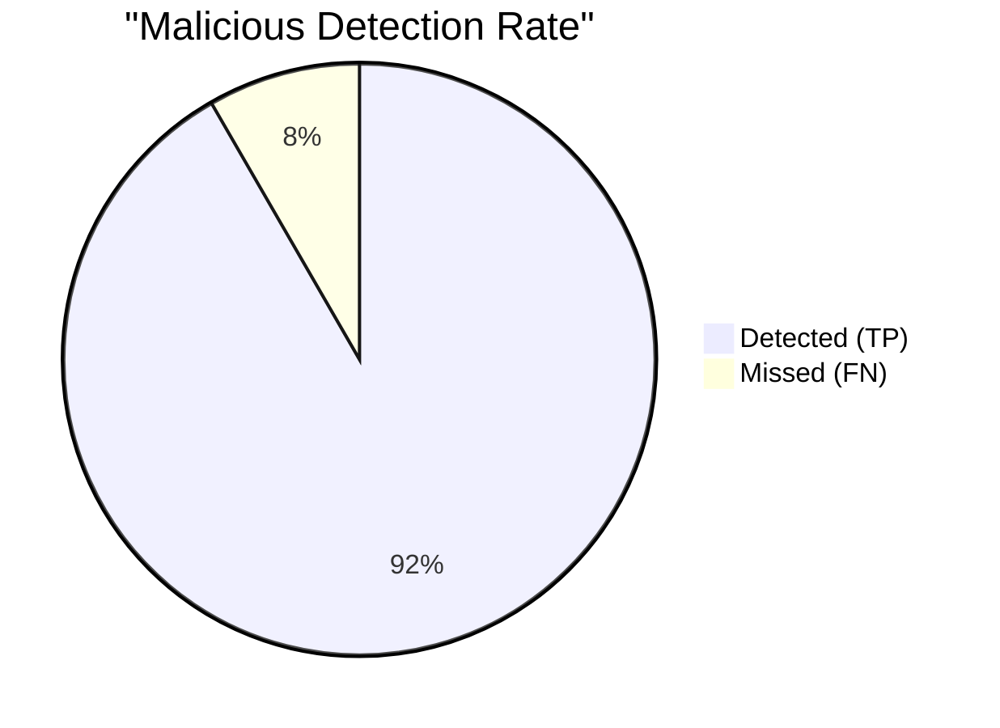

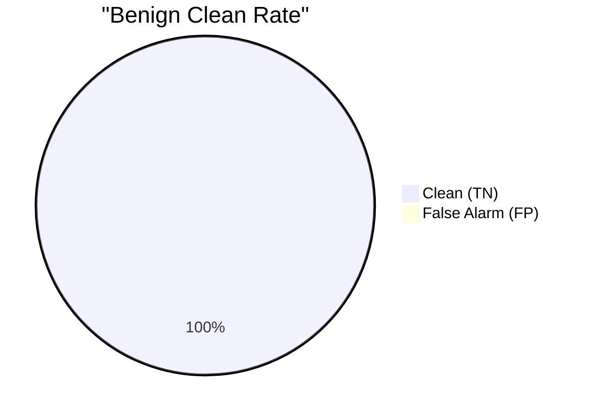

## 19. Performance

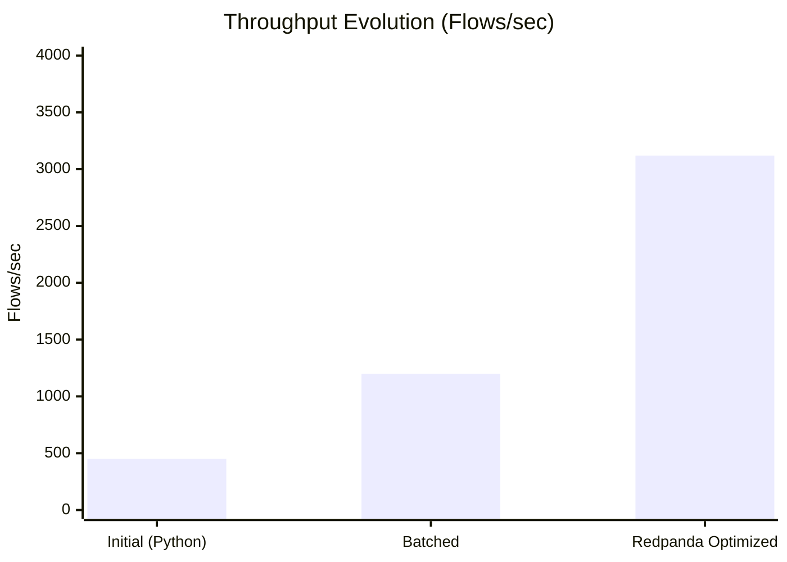
| Metric | Value | Source | Scope |
| :--- | :--- | :--- | :--- |
| Throughput | ~3,120 records/s | `performance.json` | Containerized buffered-ingestion benchmark (NOT WIRE RATE) |
| Latency | ~1.40 ms | `v5_evaluation.json` | P50 ML Inference time |

## 20. Failure/Recovery Matrix

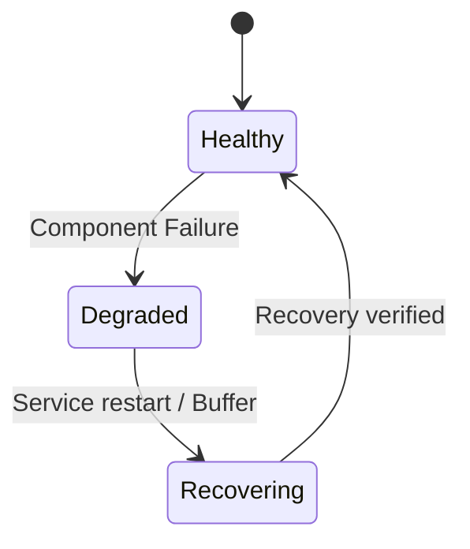

| Component | Failure | Expected | Observed | Status |
| :--- | :--- | :--- | :--- | :--- |
| Zeek | Crash | Adapter health degrades | Resumes processing tail | Restart-resilient |
| Redpanda | Broker Down | Adapter queues memory | Buffers until memory limit | At-least-once |
| MongoDB | DB Down | Fusion fails | Retries saving cases | Duplicate-safe |

## 21. Canary/Rollback Lifecycle

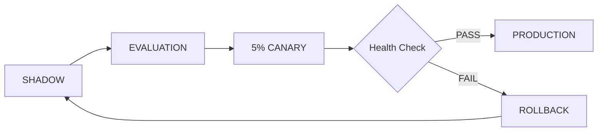
*(Note: System supports ModelRegistry state transitions. Canary SLA breaches result in automatic rollback to stable models.)*

## 22. Security / Passivity
*   **Software Passivity:** Validated via PCAP/Container tests that the platform emits NO packets to the monitored interface.
*   **Physical Enforcement:** NOT VALIDATED (Pending Hardware Data Diode).

## 23. CyberOS Compliance Matrix

| Requirement | Code | Validation Level | Status |
| :--- | :--- | :--- | :--- |
| Unidirectional Ingest | `zeek_adapter.py` | Container | VERIFIED |
| Volumetric DDoS | `ddos.py` | Unit / PCAP | VERIFIED |
| Botnet C2 / Encrypted | `tls.py`, `beacon.py` | Unit / PCAP | VERIFIED |
| DGA / DNS Tunnel | `dns.py` | Unit / PCAP | VERIFIED |
| Recon / Port Scan | `scan.py` | Unit / PCAP | VERIFIED |
| Data Exfiltration | `exfil.py` | Unit / PCAP | VERIFIED |
| Standard Alert Schema | `schema.py` | Container | VERIFIED |

## 24. Hardware Deployment Gate

| Physical Requirement | Validation Status |
| :--- | :--- |
| Physical NIC | 🟥 NOT VALIDATED |
| SPAN / TAP | 🟥 NOT VALIDATED |
| Hardware Data Diode | 🟥 NOT VALIDATED |
| Physical Wire Throughput | 🟥 NOT VALIDATED |
| Physical Long-Duration Soak | 🟥 NOT VALIDATED |

## 25. Research & References

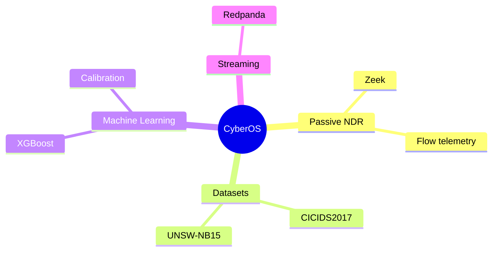

## 26. What We Learned

1.  **Production feature semantics matter**: Offline Scapy training fails instantly on production Zeek logs.
2.  **Offline ML &ne; production ML**: Real-time temporal windows require explicitly bounded state.
3.  **Streaming state must be bounded**: Unlimited hash maps in RAM cause OOM; redis expiration is required.
4.  **Rules + ML are stronger together**: Deterministic logic handles known edge-cases (Slowloris), ML handles behavioral variance.
5.  **Physical deployment claims require physical evidence**: We refuse to call PCAP replay "Wire-Speed Validation".

## 27. Evidence Index

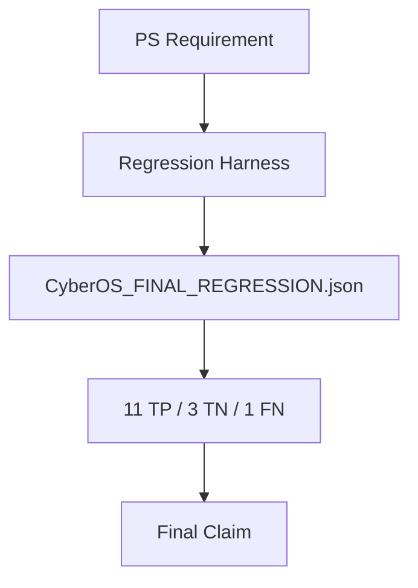

## 28. Independent Build Verification
The integrity of this engineering record is supported by the actual repository artifacts, Python source files, Docker configuration, training scripts (`train_v5.py`), model artifacts (`xgboost_v5.bin`), evaluation JSONs, and streaming workers located in the `cyberos-prototype` directory.

## 29. Final Verdict

┌──────────────────────────────────────────────┐
│ CyberOS FUNCTIONAL PROTOTYPE VERIFIED        │
└──────────────────────────────────────────────┘

┌──────────────────────────────────────────────┐
│ PCAP / CONTAINER DEPLOYMENT VALIDATED        │
└──────────────────────────────────────────────┘

┌──────────────────────────────────────────────┐
│ PHYSICAL DEPLOYMENT NOT VALIDATED            │
└──────────────────────────────────────────────┘
